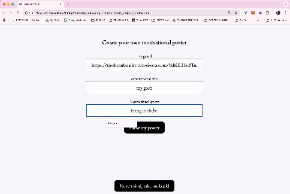

# Hang in There  

### Abstract:
This *Hang In There* Motivational Posters Project is an interactive web application where users can generate random motivational posters, create their own, and save their favorites.  For the snarky among us, there is also a feature that allows users to manage (view and delete) a collection of  unmotivational posters. 

This project demonstrates DOM manipulation, event handling, and dynamic content creation in JavaScript.  

### Installation Instructions:
1. Clone the repository:

```git clone <repository-url>```

2. Navigate to the project directory:

```cd posters-project```

3. Open the `index.html` file in your browser to run the application locally.

### Preview of App:
The 'Make Your Own Poster' feature has been a fan favorite! 



### Context:
 
This project was created as part of a FE module in a coding bootcamp to practice core CSS, HTML, and Javascript fundamentals. I was given about a week to work on it, and it was assigned during week one of the FE module (about 5-6 weeks into the program). The proejct focuses on:

* DOM manipulation

* Array iteration methods (forEach, filter, etc.)

* Event handling

* Dynamic data updates

### Contributors:
K Weiland
GitHub: @KMPWeiland


### Learning Goals:
Some of the learning goals for this project include:

* Understand how to manipulate the DOM to dynamically render content.

* Use event listeners to create interactive user experiences.

* Practice managing state in JavaScript applications.

* Implement array methods like forEach, filter, and map effectively.

* Debug and resolve issues related to scope, event handling, and asynchronous updates.

### Wins + Challenges:
**Wins**

* Implemented a dynamic rendering of posters using JavaScript

* Allowed for custom user input to create personalized posters

* Solved hiccups with adding duplicate posters in the saved posters grid AND removing deleted posters from the data model

* The addition of target.closest allowed a refactoring of the deleteUnMoPosters function

* Learned how to include a method within an even listener

**Challenges**
* Handling currentPoster and ensuring updates reflected correctly in the DOM, or more generally, discerning between data model and DOM updates was a frequent tripping point

* Struggled with dynamic DOM element insertion using .innerHTML +=, which led to a convoluted workaround for rendering motivational posters 

* Struggled with invoking deleteUnMoPoster with a faulty event listener, prompting me to wrap it in an inline function

**Refactor Opportunities**
* I detect several pieces of redundant code, including in the functions that hide and reveal various sections. I would combine those in adheracne to DRY principles if given more time.
* Simplify the renderUnMoPosters function utilizing using .innerHTML += logic