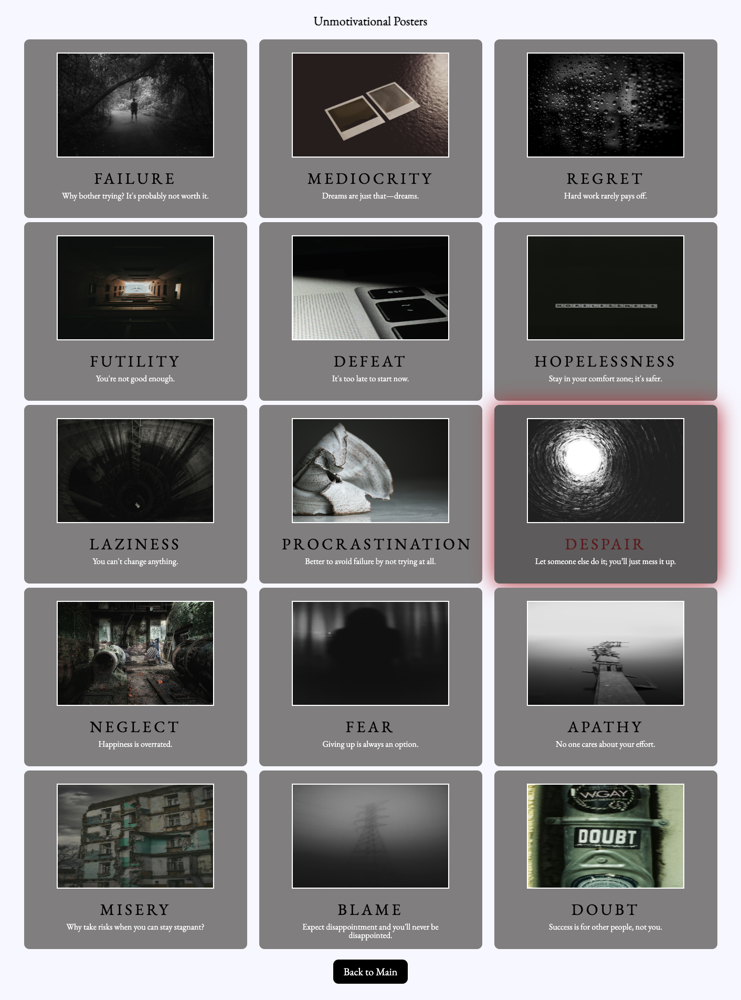
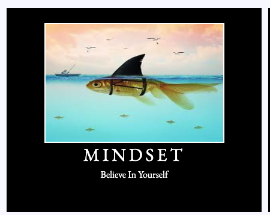

# Hang in There  

### 🎨 Abstract:
[//]: <> 
This "Motivational Posters" project generates a random motivational poster to inspire the user. Other functionality includes creating a unique poster with user input for a title, quote and photo. All of these posters can be saved and viewed in a group. For an added bonus, viewers can go to an "unmotivational poster" page for some dark humor. What better way to motivate people than through comedy! If these unmotivational posters are not to the users taste, they can double-click them to make them disappear from the page.

### 🖥️ Installation Instructions:
[//]: <> 
1. Fork this repository
2. Clone down your new, forked repo
3. `cd` into the repository
4. Open it in your text editor
5. Add the instructors as collaborators on the repository

Project spec & rubric can be found [here](https://curriculum.turing.edu/module2/projects/hang-in-there/index)

To view your project:

1. In your terminal, navigate to your project repo
2. Run the command `open index.html` 

### 🔎 Preview of App:
[//]: <> 

   

   

### 🗒️ Context:
[//]: <> 
This solo GitHub project is from Turing School of Software and Design's start of Mod 2, which is the seventh week of the program. Within an eight day deadline, this assignment challenged us to integrate our skills learned thus far to design, develop and deploy a fully functional GitHub project.

### 👏🏽 Credits:
[//]: <> 
Terra D. Manning 
https://www.linkedin.com/in/terra-manning/ 
https://github.com/TDManning 

### 🌱 Learning Goals:
[//]: <> 
1. Practice reading, understanding, and using existing code
2. Write clean, DRY JavaScript
  * Build out funcitonality using functions that6 show trends toward SRP
  * Manipulate the page after it has loaded by adding, removing, and updating elements on the DOM
3. Use CSS and HTML to match styling and layout of provided comps

### 🏆 Wins + Challenges:
[//]: <> 
Overall, this project was a lot of fun and each creating the javascript code in each iteration was rewarding because of its immediate functionality on the DOM. It was challenging to get the CSS alignment correct using flexbox and javascript, however the use of the Dev Console Tools make the trial and error process much more manageable.
