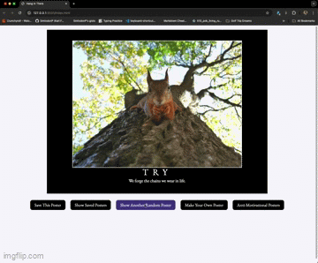

# Hang in There  

### Abstract:
[/x/]: <> (Briefly describe what you built and its features. What problem is the app solving? How does this application solve that problem?)
Here we have a wonderful application devoted to providing its users with a randomized source of motivation and inspiration. From the homepage our users can choose to create random motivational posters that pull from a curated collection of images, titles, and quotes to build an image that is sure to brighten your day(or at least make you laugh). You can also create your own custom posters using whatever image and text you can come up with. The sky is the limit! Whenever you either stumble across a randomly generated poster that really speaks to you, or you create a poster that you are especially proud of, you can save the poster and return to it later in our Saved Posters gallery. But that's not all! For those who are less inclined towards positivity, we also provide our users with a gallery filled with Anti-Motivational to peruse at their whim. Are you in the mood to destroy some negativity? Well then wait until you hear this, when a user double clicks on one of our Anti-Motivational Posters, it will disapear forever (or at least until you completely reload the page)!
### Installation Instructions:
[/x/]: <> (What steps does a person have to take to get your app cloned down and running?)
To access this application, please clone down a copy from this [GitHub repository](https://github.com/SmilodonP/hanging-in-there). Once that is complete, from your terminal, cd into the project file and enter "code ." into your terminal. This will open the project in your VSCode. From here simply right click on the "index.html" file and select "Open With Live Server". This should open the application in a new browser window where you can interact with it to your heart's content. If you do not have the Live Server VSCode extension installed, you can use the alternative method of navigating to the "Run" column at the top of the page and clicking "Run Without Debugging".
### Preview of App:
[//]: <> (Provide ONE gif or screenshot of your application - choose the "coolest" piece of functionality to show off. gifs preferred!)

### Context:
[//]: <> (Give some context for the project here. How long did you have to work on it? How far into the Turing program are you?)
This was our first project in the second module of The Turing School of Software & Design's fullstack software engineering program, and the first front end project that we have been assigned. We were given 10 days to complete the project.
### Contributors:
[//]: <> (Who worked on this application? Link to your GitHub. Consider also providing LinkedIn link)
I worked on this project by myself. My name is Karl. [Github](https://github.com/SmilodonP) | [LinkedIn](https://www.linkedin.com/in/karlfallenius/)
### Learning Goals:
[//]: <> (What were the learning goals of this project? What tech did you work with?)
This was a brown field project that tested and grew our ability to read, understand, and work with code that was already written by someone else, and then to extrapolate upon the given code, establishing and expanding its functionality. We worked with JavaScript, HTML, & CSS.
### Wins + Challenges:
[//]: <> (What are 2-3 wins you have from this project? What were some challenges you faced - and how did you get over them?)
This was by far my most successful project at Turing to date. This feels extra special as I am brand new to working with these languages. I am really proud of everything I accomplished with this project. 