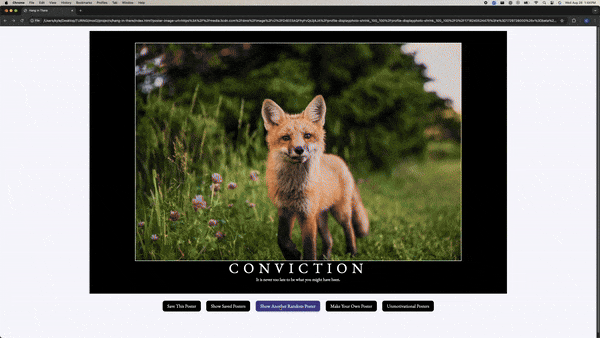

# Hang in There  

### Abstract:
[//]: <> (Briefly describe what you built and its features. What problem is the app solving? How does this application solve that problem?)
- The Hang in There page is a motivational poster generator designed to provide users with custom-generated posters. It creates and displays posters with images, titles, and quotes from an included dataset, ensuring each poster is uniquely motivational. Users can generate posters based on their preferences, save their favorite ones to a *Saved Posters* page, and access an *Unmotivational Posters* page featuring posters with less uplifting themes. On the *Unmotivational Posters* page, users have the option to remove posters by double-clicking them.

### Installation Instructions:
[//]: <> (What steps does a person have to take to get your app cloned down and running?)
- Fork or clone this repo, then clone your copy to your machine with `git clone <insert SSH key here>`. `cd` into the directory for the project and open with `code .`. Once the project is open in your IDE right clicking on `index.html` will present you an option to preview the code in a browser/in the IDE. Previewing will display a local version of the functioning page.

### Preview of App:
[//]: <> (Provide ONE gif or screenshot of your application - choose the "coolest" piece of functionality to show off. gifs preferred!)

### Context:
[//]: <> (Give some context for the project here. How long did you have to work on it? How far into the Turing program are you?)
- I worked on this project over the course of 1 1/2 weeks while primarily focusing on Turing curriculum throughout that time. Approximately 8 hours was spend on this project from start to finish.

### Contributors:
[//]: <> (Who worked on this application? Link to your GitHub. Consider also providing LinkedIn link)
#### Kyle Delaney
- [GitHub Profile](https://github.com/kylomite)
- [LinkedIn Profile](https://www.linkedin.com/in/kylehamptondelaney/)

### Learning Goals:
[//]: <> (What were the learning goals of this project? What tech did you work with?)
- The learning goals for this project were as follows:
  - Become more familiar with the 3 core front-end languages: **HTML**, **CSS**, and **JavaScript**.
  - Create optimized code with little to no unnecessary lines.
  - Isolate component functionality to each respective language file. All logic is handled by `main.js`, all styling is done in `styles.css`, and `index.html` does not contain any inline CSS or logical functionality.

### Wins + Challenges:
[//]: <> (What are 2-3 wins you have from this project? What were some challenges you faced - and how did you get over them?)
- I succesfully incorperated 2 qualities in my code design:
  - I was able to create functions that utilized arguments, which allowed for the reuse of these methods.
  - I utilized helper functions throughout my development that make my code follow the SRP and account for developer empathy.
- This project offered some unique challenges to my workflow:
  - My workflow on this project utilized regular refactoring, I would finish an iteration, move on to the next one, and realize I could achieve my objective more easily if I changed a quality of the previously required functionality. This challenge was overcome by brute force refactoring over the course of several iterations. In the future I will read the requirments for each iteration so I understand my goals for the whole project and locally for any iteration.
  - I often encountered situations where I was not able to produce the expected result. Overcoming this challenge required collaboration with others as well as utilizing online resources such as [MDN](https://developer.mozilla.org/en-US/) and [W3School](https://www.w3schools.com/).
