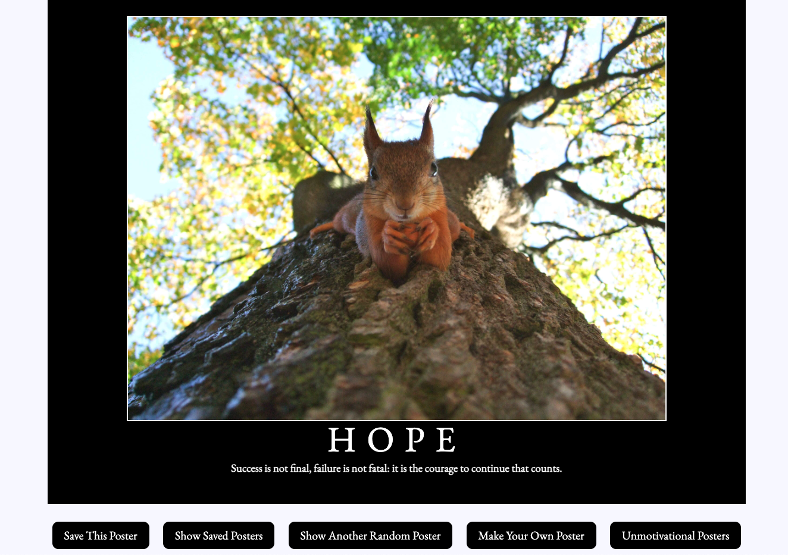
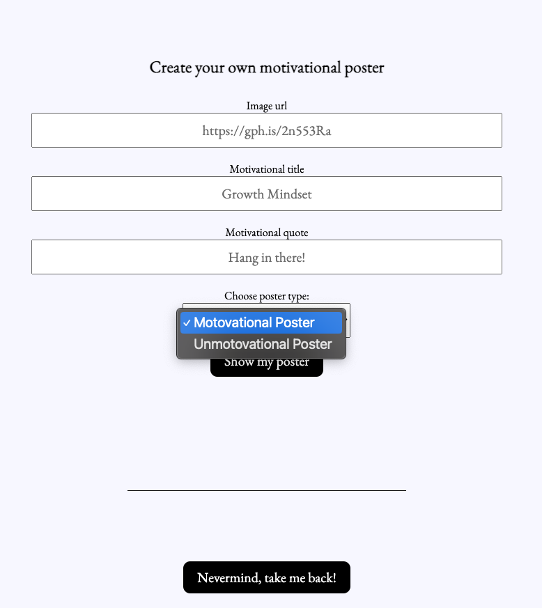

# Hang in There  

### Abstract:
[//]: <> (Briefly describe what you built and its features. What problem is the app solving? How does this application solve that problem?)
This project is a one stop spot for building, saving, and viewing company posters to lift the spirits of employees. Select from an assortment of provided images, titles and quotes to customize your own poster before saving it and if you can't find something you like import your own with the make your own poster feature. From the `Make Your Own Poster` you are able to create either a motivational poster or an unmotivational poster. 

Once saved, those posters that you made are saved into their own page where they'll be presented into a grid. If you want to see them larger, give the poster a click to see it expand.

If motivation isn't what you are looking for, there is also a section of predefined unmotivational posters. However, if you don't like any of the specific posters, double click to remove it from those that are being displayed. Again, you are able to add your own posters using the `Make Your Own Poster` form.

### Installation Instructions:
[//]: <> (What steps does a person have to take to get your app cloned down and running?)
1. Fork this repository
2. Clone down your new, forked repo
3. `cd` into the repository
4. In your terminal, navigate to your project repo
5. Run the command open index.html

### Preview of App:
[//]: <> (Provide ONE gif or screenshot of your application - choose the "coolest" piece of functionality to show off. gifs preferred!)

### Context:
[//]: <> (Give some context for the project here. How long did you have to work on it? How far into the Turing program are you?)
This was the first project that was done during the second mod of Turing School of Software and Design. We had just been introduced to HTML, JavaScript, and CSS after spending the first six weeks learning through Ruby. This introductory project into the front end development took roughly a week of development, working on it a few hours each day. 

### Contributors:
[//]: <> (Who worked on this application? Link to your GitHub. Consider also providing LinkedIn link)
Solo project with minor assists from others within my cohort at Turing. Inspirations taken from other cohort members as well.

### Learning Goals:
[//]: <> (What were the learning goals of this project? What tech did you work with?)
This project was to help us get familiar with JavaScript, HTML, and CSS all interacting with each other. We were to get familiar with interacting with the DOM of the page so that we could have plenty of dynamic interactions with the pages. We worked with a single page project so that we learned more about the functions of CSS particularly in regards to hiding sections of the page or revealing it. 

The page was only minorly modified directly, with most changes to the HTML coming dynamically from the JavaScript. CSS was also added or subtracted through the use of the JavaScript file.
### Wins + Challenges:
[//]: <> (What are 2-3 wins you have from this project? What were some challenges you faced - and how did you get over them?)
