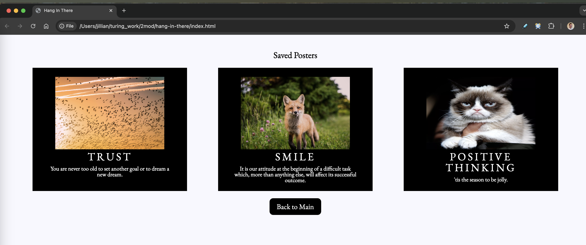

# Hang in There  

### Abstract:
This project randomizes classic motivational posters for those in need of a pick-me-up... and offers an "un"-motivational poster section for their cynical friends! Features include a "create your own" page, where users can provide the link to a photo online and enter their own title and quote to display their own motivational (or unmotivational) posters. Users can also save favorite posters to revisit later. 

### Installation Instructions:
*For installation on Apple products only.*
1.  To download this program onto your computer, copy and paste `git@github.com:jbleggi/hang-in-there.git` into your computer's terminal. 
2.  Navigate into the `hang-in-there` folder on the terminal. 
3.  Copy and paste `open index.html` to interact with the program on your internet browser.

### Preview of App:

### Context:
This project was created in 6 days (between December 4 and 10, 2024) as a solo project assigned during Module 2 (of 4) at the [Turing School of Development and Design](https://turing.edu/). 

### Contributors:
**Jillian Bleggi**  
[See my other projects on GitHub](https://github.com/jbleggi)  
[Find me on LinkedIn](https://www.linkedin.com/in/jillianbleggi/)

### Learning Goals:
-   Practice reading, understanding, and using existing code
-   Write clean, DRY JavaScript
-   Build out functionality using functions that show trends toward SRP
    -   Manipulate the page after it has loaded by adding, removing, and updating elements on the DOM
    -   Use array prototype iterator methods to reformat data and display it on the DOM
-   Use CSS and HTML to match styling and layout of provided comps

### Wins + Challenges:
As my first project using Javascript, CSS, and HTML, I am proud of the progress and functionality I was able to create in a few days. Challenges included creating the double-click delete feature in the unmotivational posters section and refactoring to make the Javascript code readable. I enjoyed being able to design and manipulate the styles on the page by using an external style sheet, and was pleased how quickly I was able to pick up CSS styling with this project. 